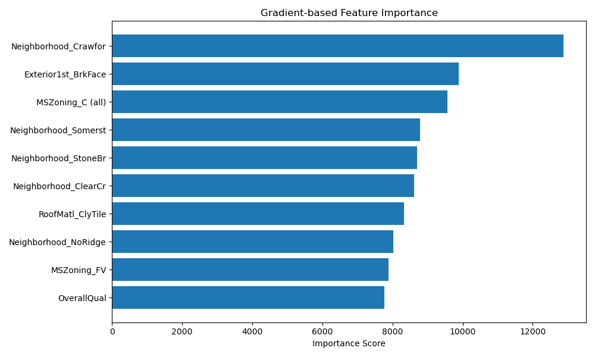

## 项目分析

### 介绍

该项目是Kaggle比赛的[房价预测项目](https://www.kaggle.com/competitions/house-prices-advanced-regression-techniques/overview) 。

项目数据涵盖了2006-2010年期间亚利桑那州埃姆斯市的房价，数据集可以从项目网站下载，可以从包含数据集的[URL](http://d2l-data.s3-accelerate.amazonaws.com/)下载。

----

### 项目流程

1. **下载和加载数据集**
2. **数据预处理**
3. **K折交叉验证**
4. **模型选择和超参数调优**
5. **训练并保存模型**
6. **特征重要性分析**
7. **预测**

---

### 数据预处理

1. **异常值检测**

   因为房价分布属于重尾分布，所以使用柯西分布检测异常值。并删除这些异常的样本。对于其他的特征，不太好检测异常值，故暂不进行处理。

   删除的训练样本数：182。

2. **缺失值填充**

   我们分别计算数值型和类别型特征的缺失值比例，根据不同比例采取不同的措施处理缺失值。 

   数值型特征前4个最大的缺失值比例为：

   `['18.47%', '6.34%', '0.55%', '0.00%']`， 

   可以看到数值型特征的缺失值比例整体都比较低，除了一个达到18.47%，但它也不算太高，因此对所有数值型缺失值均采用均值填充。

   而类别型特征前8个最大的缺失值比例为：

   `['99.61%', '96.01%', '92.96%', '78.87%', '64.87%', '53.60%', '6.34%', '6.34%']`，

   可以看到类别型特征的缺失值比例特别高。对于缺失比例＞90%的特征，信息量过少，我们选择直接删除；对于缺失比例为10%~90%的特征，我们选择保留缺失值，将缺失值也视为一种类别；对于缺失比例<10%的特征，我们选择用众数填充缺失值。

   ==在`Init_code.py`中没有使用异常值检测，缺失值比例的有些变化，但幅度比较小，缺失值选择一样的处理方式==

3. **物理特征工程**

   考虑到房价会受到宏观经济周期以及国家政策的影响，会呈现周期性波动，构建时间周期特征将会有助于模型识别这些因素的影响。因此，根据`YearBuilt`特征构建两个新的特征，`YearSin`和`YearCos`。

   由于没有当地的经济周期或政策周期的相关信息，所以这里笼统地选择100年为一个周期，使得足够覆盖大多数房屋的建造年份范围，同时特征变化也比较平滑，避免周期过短导致特征变化过于频繁。

----

### 训练

1. **模型**

   刚开始使用线性模型，为了进一步提高模型的表达能力，现在使用多层感知机模型。==未来会考虑其他更复杂的模型。==

2. **损失函数**

   训练时，刚开始使用均方误差(MSE)为损失函数，随着模型变得复杂，使用弹性网络正则化作为损失函数，把L1和L2正则化考虑进来，避免模型过拟合。

   评估时，使用对数均方根误差(log RMSE)作为损失函数，原因是房价是重尾分布，我们关心的是相对偏差，而不是绝对偏差。

3. **优化器**

   刚开始使用随机梯度下降算法(SGD)，SGD对学习率高度敏感，过大的学习率会导致参数更新步长过大，损失暴增甚至出现NaN。且学习率固定，导致有时候参数更新过大，损失优化不够好。因此改用Adam优化算法。

   为了进一步提高优化效率和稳定性，增加动态的学习率。

4. **超参数调优**

   使用K折交叉验证和网络搜索，粗略寻找最优的超参数。
   
   - **交叉验证折数**：$[3,\cdots,8]$
   
   - **学习率**：$[10^{-5},\cdots, 10^{-1}]$
   - **批量大小**：$[2^4,\cdots, 2^8]$
   - **隐藏层数**：$[1, 2, 3]$
   - **正则化强度**：$[10^{-4}, \cdots, 10^{-1}]$
   - **L1正则化比率**：$[0, \cdots, 1]$
   
   为了提高调参效率，使用Optuna工具实现自动化超参搜索。
   
   ==把回合数放入调参有时候会出现过拟合现象，目前正在处理==

----

### 特征重要性分析

随机选取100个训练样本，通过计算平均梯度，给出前10个对模型影响最大的特征。

...

----

### 模型对比

**模型参数**

| 版本       | 折数k | 回合数 | 学习率 | 批量大小 | 隐藏层数 | 正则化强度 | L1正则化比率 | 优化算法 | 平均验证损失(log rmse) | 训练损失 | 测试损失 |
| ---------- | ----- | ------ | ------ | -------- | -------- | ---------- | ------------ | -------- | ---------------------- | -------- | -------- |
| Init_model | 8     | 102    | 0.0029 | 32       | 无       | 无         | 无           | SGD      | 0.1515                 | 0.1337   | 0.1526   |
| MLP_model  | 8     | 20     | 0.0422 | 16       | 1        | 0.0956     | 0.7462       | Adam     | 0.1163                 | 0.1063   | 0.1721   |

----

### 后续改进

- 使用早停技术取代对回合数的调参

- 使用Flask部署预测API
- 考虑随机森林模型和transformer模型的效果
- 使用GPU加速

-----

First 4 maximal missing ratios in numerical features: ['17.74%', '5.55%', '0.55%', '0.00%']
First 5 maximal missing ratios in category features: ['99.52%', '96.30%', '93.77%', '80.75%', '59.73%', '47.26%', '5.55%']